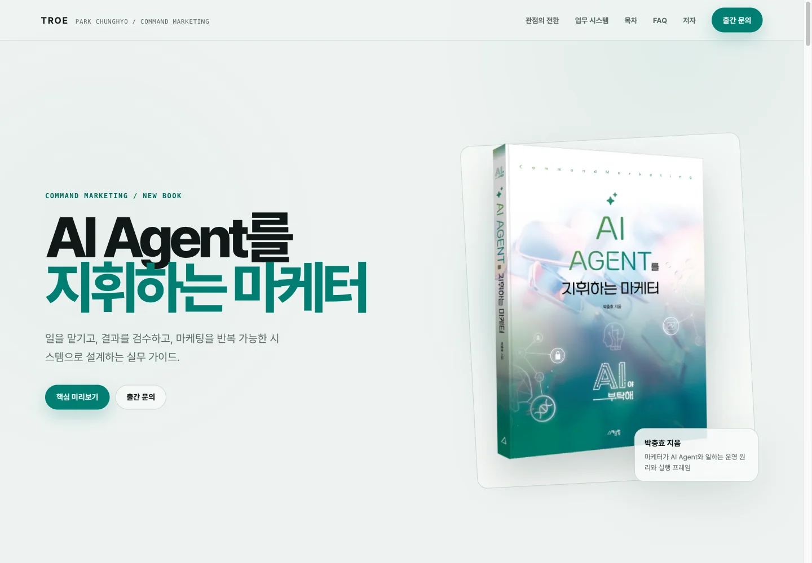
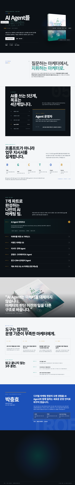

<p align="center">
  
</p>

<h1 align="center">AI Agent를 지휘하는 마케터</h1>

<p align="center">
  AI에게 일을 맡기고, 결과를 검수하고,<br>
  마케팅을 반복 가능한 시스템으로 설계하는 <strong>Command Marketing 도서 사이트</strong>
</p>

<p align="center">
  <a href="https://book.allrounder.im/"><strong>운영 사이트</strong></a>
  ·
  <a href="#로컬에서-실행하기">로컬 실행</a>
  ·
  <a href="mailto:chunghyo@troe.kr?subject=AI%20Agent%EB%A5%BC%20%EC%A7%80%ED%9C%98%ED%95%98%EB%8A%94%20%EB%A7%88%EC%BC%80%ED%84%B0%20%EB%AC%B8%EC%9D%98">출간·강연 문의</a>
</p>

<p align="center">
  <code>TROE</code> · <code>박충효</code> · <code>Static HTML</code> · <code>Responsive</code> · <code>SEO/GEO</code>
</p>

---

## 한눈에 보기

<p align="center">
  <a href="https://book.allrounder.im/">
    
  </a>
</p>

이 저장소는 박충효 저 『AI Agent를 지휘하는 마케터』의 핵심 메시지를 웹에서 경험할 수 있도록 만든 반응형 프로모션 사이트입니다. 책 표지의 청록색 인상과 TROE의 절제된 브랜드 시스템을 비대칭 출판물 레이아웃으로 연결했습니다.

최신 운영본은 한국어 어절이 중간에서 끊기지 않도록 조판을 교정하고, 마지막 문의 섹션의 책 표지를 원본 비율로 다시 설계했습니다.

## 사이트가 설명하는 것

| 주제 | 핵심 내용 |
|---|---|
| AI 활용 성숙도 | 도구 사용자에서 커맨드 마케터로 이동하는 5단계 |
| R-G-C-T-O-R | Role, Goal, Context, Tool, Output, Review로 업무 지시를 구조화하는 방법 |
| 도서 구성 | AI Agent 리터러시부터 리서치, 콘텐츠, 광고, CRM, 운영 매뉴얼까지 7개 파트 |
| 21일 훈련 | 업무 분해, 지시·검수 기준, 반복 운영을 연결하는 실천 플랜 |
| 사람과 Agent의 역할 | 사람은 목표·기준·승인·책임을, Agent는 리서치·초안·반복 실행을 담당 |
| 저자와 TROE | 박충효의 마케팅·AI/AX 전문성과 출간·강연 문의 동선 |

## 로컬에서 실행하기

별도 빌드나 패키지 설치가 필요하지 않습니다.

```bash
git clone https://github.com/saewookkangboy/commandaiagent.git
cd commandaiagent
python3 -m http.server 4173 --directory dist
```

브라우저에서 [http://localhost:4173](http://localhost:4173)을 열면 됩니다. 정적 파일을 직접 확인하려면 `dist/index.html`을 열어도 됩니다.

## 구현 원칙

- HTML, CSS, Vanilla JavaScript로 구성한 정적 단일 페이지
- 외부 프레임워크와 웹폰트 의존성 없음
- 1440px 데스크톱부터 390px 모바일까지 명시적인 반응형 레이아웃
- `word-break: keep-all`과 `text-wrap: pretty`를 활용한 한국어 중심 조판
- 시스템 설정에 따라 전환되는 라이트·다크 컬러 토큰
- `prefers-reduced-motion`과 `prefers-reduced-transparency` 대응
- 키보드 화살표로 이동하는 AI 성숙도 탭과 자동 닫힘 모바일 메뉴
- 원본 도서 이미지는 보존하고 히어로에는 34KB WebP 사용
- 마지막 문의 섹션의 표지는 `object-fit: contain`으로 2244 × 3071 원본 비율 보존
- Vercel `dist` 정적 배포와 GitHub Pages 보조 배포

## 디자인 방향

리디자인은 [Leonxlnx/taste-skill](https://github.com/Leonxlnx/taste-skill)의 Redesign-Preserve 원칙을 적용했습니다. 도서의 정보 구조와 SEO 자산은 유지하고 타이포그래피, 여백, 컬러 토큰, 모션과 핵심 섹션의 읽기 순서를 개선했습니다.

| 디자인 결정 | 적용 |
|---|---|
| Design Variance | `7`: 비대칭 출판물 레이아웃 |
| Motion Intensity | `5`: 절제된 진입 모션과 상태 전환 |
| Visual Density | `4`: 긴 호흡의 여백과 필요한 정보만 노출 |
| 강조색 | Book Teal `#007E71` |
| 표면 | Paper `#EEF3F1`, Surface `#F8FAF9`, Dark `#0D1514` |
| 타이포그래피 | 별도 다운로드가 없는 시스템 글꼴 |

## SEO · GEO

검색엔진과 AI 검색 시스템이 페이지의 주제·저자·도서 구조를 일관되게 해석하도록 다음 요소를 함께 제공합니다.

- 검색 제목, 설명, 저자, 발행자, canonical과 robots 메타 태그
- Open Graph와 X 카드 메타데이터 및 실제 도서 이미지
- WebSite, Organization, Person, Book, WebPage, FAQPage를 연결한 JSON-LD `@graph`
- 본문과 구조화 데이터가 일치하는 직접 답변 FAQ 6개
- canonical URL과 수정일을 포함한 `sitemap.xml`
- 검색 크롤러와 모델 학습 크롤러를 분리한 `robots.txt`
- AI 시스템이 핵심 사실과 신뢰 링크를 확인할 수 있는 `llms.txt`

`llms.txt`는 일부 AI 시스템을 위한 보조 문서입니다. 검색 노출의 기본은 공개 URL, 크롤링 가능성, 유용한 본문과 일관된 구조화 데이터입니다.

## 프로젝트 구조

| 경로 | 역할 |
|---|---|
| `dist/index.html` | 사이트 본문, 스타일, 인터랙션과 구조화 데이터 |
| `dist/assets/` | 도서 표지·실물 이미지와 최적화 WebP |
| `dist/robots.txt` | 검색·AI 크롤러 접근 정책 |
| `dist/sitemap.xml` | 운영 URL과 수정일 |
| `dist/llms.txt` | AI 검색용 핵심 사실 요약 |
| `docs/readme/` | GitHub README 검수 이미지 |
| `vercel.json` | Vercel 출력 디렉터리와 보안 헤더 |

<details>
<summary><strong>전체 페이지 검수 화면 보기</strong></summary>

<br>

<p align="center">
  
</p>

</details>

## 배포와 검증

- 운영 도메인: [book.allrounder.im](https://book.allrounder.im/)
- Vercel 프로젝트: `chunghyos-projects/commandaiagent`
- 프로덕션 출력: `dist`
- 보조 배포: GitHub Pages

| 검증 항목 | 결과 |
|---|---|
| Lighthouse | Performance 100 · Accessibility 100 · Best Practices 100 · SEO 100 |
| 반응형 렌더 | 데스크톱 1440 × 1000 · 모바일 609 × 848 / 390 × 844 |
| 브라우저 | 가로 오버플로우 0 · 콘솔 오류·경고 0 |
| 인터랙션 | 성숙도 탭 · 모바일 메뉴 · 목차/FAQ 아코디언 |
| 구조화 데이터 | JSON-LD 6종 파싱 · FAQ 6개 일치 |
| 운영 파일 | `robots.txt` · `sitemap.xml` · `llms.txt` HTTP 200 |

## 콘텐츠 출처와 사용 범위

사이트 내용은 최종 내지 PDF 320쪽에서 확인한 프롤로그, 7개 파트 목차, AI 활용 성숙도 5단계, R-G-C-T-O-R과 21일 훈련 플랜을 바탕으로 구성했습니다. 원본 PDF는 이 저장소에 포함하지 않습니다.

판매처 URL은 확정 정보가 없어 임의로 연결하지 않았습니다. 현재 CTA는 출간·단체 구매·강연·교육 문의로 연결됩니다.

## TROE · 박충효

- [TROE](https://troe.kr/)
- [박충효 포트폴리오](https://park.allrounder.im/)
- [LinkedIn](https://www.linkedin.com/in/chunghyopark/)
- 문의: [chunghyo@troe.kr](mailto:chunghyo@troe.kr)

## 저작권

책 표지 이미지, 도서 콘텐츠와 TROE·박충효 브랜드 자산의 권리는 각 권리자에게 있습니다. 이 저장소에는 별도의 오픈소스 라이선스가 부여되지 않았으며, 이미지와 콘텐츠의 재배포·상업적 사용은 권리자의 사전 허가가 필요합니다.
